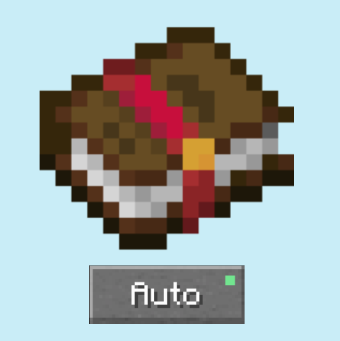
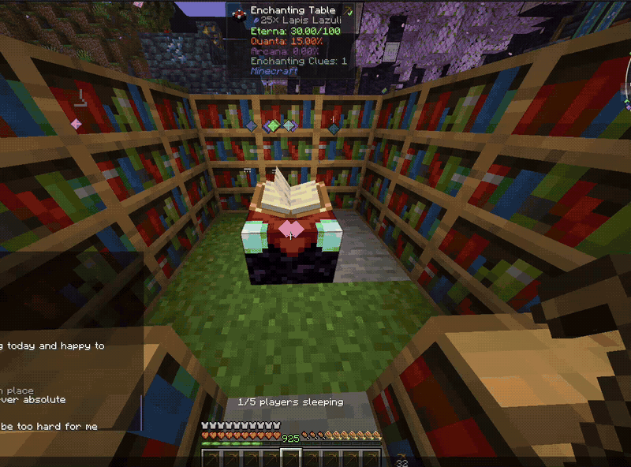

# AutoEnchant (NeoForge 26.2)



AutoEnchant is a client-only mod that adds a small control bar to the vanilla enchantment-table screen. It can rapidly enchant every matching, enchantable item in the player's inventory while still using vanilla server-validated inventory actions, XP costs, lapis costs, offers, and enchantment results.

## Preview



[Watch the original video](https://github.com/bomxacalaka/AutoEnchant/releases/download/v1.0.0/autoenchant-demo.mp4)

## Controls

- **Item icon:** click it, then click the enchantable item you want directly in your inventory. Right-click cancels selection.
- **Lv 1–3:** chooses one of the three vanilla enchantment-table offers.
- **Enchant:** starts or stops the current batch.
- **Auto:** remembers the setting and starts a batch whenever a table is opened.
- **U:** shows or hides the complete AutoEnchant overlay. This key can be changed under Minecraft's Controls menu.

The selected item, offer, and Auto setting are saved in `config/autoenchant-client.toml`. A line under the table shows the number of matching items and warns when the total available lapis is too low for the whole batch.

## Build

```bash
./gradlew build
```

The mod JAR is written to `build/libs/`.

## In-game test checklist

1. Start a NeoForge 26.2 client with the mod and enter a creative test world.
2. Place an enchantment table with 15 correctly spaced bookshelves.
3. Give yourself XP, several identical unenchanted items, and lapis. Include an unrelated item too.
4. Open the table, click the **item icon**, click the intended inventory item, choose offer **3**, and confirm the lapis warning matches `items × 3`.
5. Add enough lapis, press **Enchant**, and confirm each matching item is enchanted and returned while the unrelated item is untouched.
6. Repeat with levels 1 and 2; confirm they consume one and two lapis per item respectively.
7. Remove enough lapis or XP mid-batch and confirm automation stops with a clear message without dropping or replacing items.
8. Enable **Auto**, close and reopen the table, and confirm the remembered item and level start automatically. Restart Minecraft once to verify the settings persist.
9. Test on a multiplayer server (with server permission) to verify its click-rate/anti-cheat policy accepts one action per client tick.
